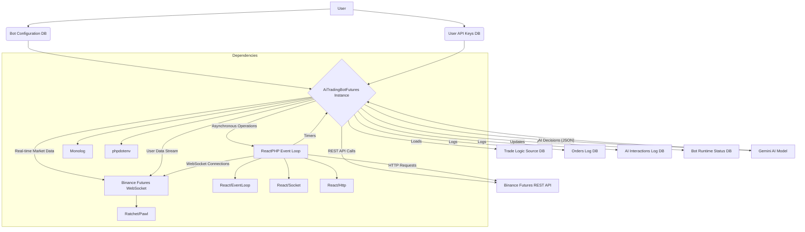

# AI-Powered Futures Trading Bot

This project is a sophisticated PHP-based trading bot designed for automated futures trading on Binance, leveraging a Gemini AI model for intelligent decision-making. It operates asynchronously, manages orders, tracks positions, and logs all activities to a database, providing a robust and adaptable solution for automated cryptocurrency trading.

## Features

*   **Automated Trading:** Executes trades on Binance Futures based on AI-driven signals.
*   **AI Integration:** Leverages the Gemini AI model for dynamic and adaptive trading strategies.
*   **Real-time Data:** Receives real-time market data (Kline) and user account updates via Binance WebSockets.
*   **Secure API Key Management:** Stores and decrypts Binance and Gemini API keys securely using application-level encryption.
*   **Configurable Bot Instances:** Supports multiple bot configurations, allowing users to run different strategies or trade different symbols.
*   **Comprehensive Logging:** Detailed logging of all trading orders, AI interactions, and bot runtime status to a MySQL/MariaDB database.
*   **Automated Risk Management:** Implements automatic Stop Loss (SL) and Take Profit (TP) order placement to manage trade risk.
*   **Environment Flexibility:** Supports both Binance production and testnet environments.
*   **Dynamic Strategy Updates:** The AI can suggest and update its own trading strategy directives in the database, allowing for continuous learning and adaptation (if configured).

## Architecture Overview

The bot's architecture is designed for high performance, reliability, and extensibility, built primarily with PHP and leveraging asynchronous programming.



*   **Core Component:** The `AiTradingBotFutures` PHP class is the central orchestrator, managing all trading logic, API interactions, and AI decision-making.
*   **Asynchronous Operations:** `ReactPHP` provides the core event loop (`React/EventLoop`), enabling non-blocking I/O for concurrent network operations (HTTP requests and WebSockets) and efficient timer management.
*   **WebSocket Communication:** `Ratchet/Pawl` is used to establish and maintain persistent WebSocket connections to Binance Futures. This allows the bot to receive real-time market data (Kline streams) and critical user account updates (User Data Stream) without blocking the main execution flow.
*   **REST API Interaction:** `React/Http` facilitates authenticated REST API calls to Binance Futures for various operations, including fetching account balances, position information, setting leverage, and placing/cancelling orders.
*   **Database (MySQL/MariaDB):** The database is a critical component for persistence and state management. It stores:
    *   `users`: User authentication and profile information.
    *   `user_api_keys`: Encrypted Binance and Gemini API credentials, linked to specific users.
    *   `bot_configurations`: Detailed settings for each trading bot instance, such as trading symbol, Kline interval, margin asset, leverage, and AI update frequency.
    *   `trade_logic_source`: Stores the AI's trading strategies and directives, allowing for versioning and dynamic updates.
    *   `orders_log`: A comprehensive history of all trading orders executed or attempted by the bots, including status, price, quantity, and realized PnL.
    *   `ai_interactions_log`: A detailed record of every interaction with the AI, including the full data context sent to the AI, the prompt, the raw AI response, and the bot's executed action.
    *   `bot_runtime_status`: Tracks the live operational status of each bot instance, including its process ID, last heartbeat, and any error messages.
*   **AI Integration:** The bot communicates with the Gemini AI model (via Google's Generative Language API) to obtain trading signals and strategic decisions. The AI's responses are strictly JSON-formatted, containing actions like `OPEN_POSITION`, `CLOSE_POSITION`, or `HOLD_POSITION`, along with relevant parameters.
*   **Environment Variables:** The `vlucas/phpdotenv` library is used to load environment-specific configurations (like API keys and database credentials) from a `.env` file, keeping sensitive information out of the codebase.
*   **Logging:** `Monolog` is integrated for robust and structured logging to standard output, providing essential insights for monitoring, debugging, and auditing bot operations.

## Logical Functioning of the Bot

The `AiTradingBotFutures` operates as an event-driven, stateful application, continuously monitoring market conditions and account status to make informed trading decisions based on AI guidance.

1.  **Initialization and Setup:**
    *   Upon startup, the bot loads critical environment variables from the `.env` file.
    *   It establishes a secure connection to the MySQL/MariaDB database.
    *   Bot-specific configurations (e.g., trading symbol, Kline interval, leverage) and encrypted user API keys (Binance, Gemini) are fetched from the database and decrypted.
    *   The active AI trading strategy is loaded from the `trade_logic_source` table. If no active strategy is found for the user, a default strategy is created and activated.
    *   Initial market data (exchange information, current price, account balance, existing positions) is fetched from Binance Futures REST API.
    *   A Binance User Data Stream `listenKey` is obtained, which is crucial for receiving real-time account updates.
    *   WebSocket connections are established to Binance Futures for both public market data (Kline streams) and private user data streams.
    *   Various periodic timers are set up for tasks like bot heartbeat, pending order checks, AI update cycles, and `listenKey` refreshes.
    *   The bot's runtime status is updated in the `bot_runtime_status` table.

2.  **Real-time Data Processing (WebSocket Handlers):**
    *   The bot continuously listens for messages from the Binance WebSockets:
        *   **Kline Updates:** When a K-line (candlestick) for the configured `tradingSymbol` and `klineInterval` closes, the `lastClosedKlinePrice` is updated. This provides the bot with the latest confirmed market price.
        *   **User Data Stream Events:** These events are critical for managing the bot's state and reacting to account changes:
            *   `ACCOUNT_UPDATE`: Monitors changes in the user's account, particularly position updates. If a position for the `tradingSymbol` is opened or closed, the bot's internal `currentPositionDetails` are updated, and post-closure logic is triggered when a position is fully closed.
            *   `ORDER_TRADE_UPDATE`: This is the primary mechanism for tracking order execution. It captures detailed information about order fills, including `realizedPnl` (profit/loss) and `commission` directly from the event.
                *   If an **entry order** is filled, the bot logs the trade and proceeds to place corresponding Stop Loss (SL) and Take Profit (TP) orders.
                *   If an **SL/TP order** is filled, the bot logs the closure, cancels the other protective order, and prepares for a new trading cycle.
                *   If any order is `CANCELED`, `EXPIRED`, or `REJECTED`, the bot resets its internal state or flags a critical condition (e.g., unprotected position) and may trigger an emergency AI update.
            *   `listenKeyExpired`: Automatically handles the renewal of the Binance User Data Stream `listenKey` to maintain continuous real-time updates.
            *   `MARGIN_CALL`: Immediately triggers an emergency AI update, prompting the AI to assess the critical situation.

3.  **AI Decision Cycle:**
    *   The AI decision-making process is initiated periodically (`aiUpdateIntervalSeconds`) or on demand (e.g., after a position closes, or in an emergency).
    *   **Data Collection (`collectDataForAI`):** The bot asynchronously gathers a comprehensive snapshot of its current environment:
        *   Live account balance and position details.
        *   Recent trade history and order logs from its internal database.
        *   Historical Kline data across multiple timeframes (e.g., 1m, 5m, 1h) to provide the AI with market context.
        *   Current operational state (e.g., if an entry order is pending, if SL/TP orders are active, if the position is unprotected).
        *   Past AI interaction feedback and the current guiding trade strategy.
    *   **Prompt Construction (`constructAIPrompt`):** This function dynamically builds a detailed JSON prompt for the Gemini AI. The prompt includes all collected data and strict instructions on the expected JSON output format, including mandatory precision for prices and quantities. It also adapts the prompt based on the bot's configured operational mode (e.g., whether the AI should calculate quantity or if it's fixed, and if the AI is allowed to update its own strategy).
    *   **AI Request (`sendRequestToAI`):** The constructed JSON prompt is sent to the Gemini AI model via HTTP POST request.
    *   **Response Processing (`processAIResponse`):** The raw JSON response from the AI is parsed. It checks for AI blocking reasons and extracts the AI's suggested action and parameters.
    *   **Decision Execution (`executeAIDecision`):**
        *   The AI's suggested action (e.g., `OPEN_POSITION`, `CLOSE_POSITION`, `HOLD_POSITION`, `DO_NOTHING`) is received.
        *   **Bot-side Validation and Overrides:** A crucial safety layer. The bot validates the AI's decision against its current operational state. For example:
            *   If an entry order is pending or a position already exists, an `OPEN_POSITION` command from AI will be overridden to `HOLD_POSITION`.
            *   If no position exists, a `CLOSE_POSITION` command will be overridden to `DO_NOTHING`.
            *   **Critical Safety Override:** If the bot detects an unprotected position (e.g., SL/TP orders are missing while a position is open) or a margin call, any AI decision other than `CLOSE_POSITION` will be overridden to `CLOSE_POSITION` to prioritize safety.
        *   **Strategy Update:** If the AI's response includes a `suggested_strategy_directives_update` and the bot's configuration allows self-updates (`allow_ai_to_update_self` is true), the bot updates its active trading strategy in the `trade_logic_source` table.
        *   **Action Execution:** The validated/overridden action is then executed:
            *   `OPEN_POSITION`: The bot sets the appropriate leverage and places a limit order at the AI-suggested entry price with the calculated quantity.
            *   `CLOSE_POSITION`: Any active protective orders (SL/TP) are cancelled, and a market order is placed to close the current position.
            *   `HOLD_POSITION`/`DO_NOTHING`: The bot maintains its current state, waiting for the next AI cycle or market event.
        *   All AI interactions, including the original AI decision, any bot overrides, and the final executed action, are logged to `ai_interactions_log`.

4.  **Order and Position Management:**
    *   **`attemptOpenPosition`:** Handles the placement of the initial limit entry order. It first sets the leverage for the trading symbol and then places the order.
    *   **`placeSlAndTpOrders`:** Called after a successful entry order fill. It places a Stop Market order (SL) and a Take Profit Market order (TP) to automatically manage risk and secure profits. These are `reduceOnly` orders.
    *   **`attemptClosePositionByAI`:** Executes a market close of the current position, typically initiated by an AI decision. It first cancels any existing SL/TP orders before placing the market order.
    *   **`checkProfitTarget` / `triggerProfitTakingClose`:** Periodically checks the unrealized PnL of the current position. If the `takeProfitTargetUsdt` is reached, it triggers a market close of the position, similar to `attemptClosePositionByAI`.
    *   **`cancelOrderAndLog`:** A utility function to cancel a specific order on Binance and log the cancellation event.
    *   **`resetTradeState`:** Clears all active order IDs and position details, preparing the bot for a new trading cycle.

## Functions Present and Their Internal Working

The `AiTradingBotFutures` class is composed of numerous methods, each responsible for a specific aspect of the bot's operation.

### Core Lifecycle & Setup

*   **`__construct(int $botConfigId, string $geminiModelName, string $appEncryptionKey, string $dbHost, string $dbPort, string $dbName, string $dbUser, string $dbPassword)`:**
    *   Initializes the bot instance with configuration ID, AI model name, encryption key, and database credentials.
    *   Sets up `React\EventLoop` and `React\Http\Browser` for asynchronous operations.
    *   Configures `Monolog` for logging to standard output, dynamically including `BotID` and `UserID` in log messages.
    *   Calls `initializeDatabaseConnection()` and `loadBotConfigurationFromDb()` to set up the database and load bot settings.
    *   Calls `loadUserAndApiKeys()` to fetch and decrypt user-specific API keys.
    *   Calls `loadActiveTradeLogicSource()` to load or create the AI's trading strategy.
    *   Sets Binance API base URLs based on `useTestnet` configuration.
*   **`run(): void`:**
    *   The main entry point for starting the bot's operation.
    *   Updates bot status to 'initializing' in the database.
    *   Uses `React\Promise\all` to concurrently fetch initial data: exchange info, account balance, latest Kline price, current position, and a Binance User Data Stream `listenKey`.
    *   Upon successful data fetching, it connects to the WebSocket (`connectWebSocket()`) and sets up all periodic timers (`setupTimers()`).
    *   Triggers an initial AI update after a short delay.
    *   Updates bot status to 'running' and starts the `ReactPHP` event loop, which is the main blocking call.
    *   Updates status to 'stopped' when the loop finishes.
*   **`stop(): void`:**
    *   Gracefully stops the bot by cancelling all active timers, closing the WebSocket connection, closing the User Data Stream `listenKey`, and stopping the `ReactPHP` event loop.
    *   Resets the PDO database connection to null.
    *   Updates the bot status to 'stopped' in the database.

### Security & Configuration Management

*   **`decrypt(string $encryptedData): string`:**
    *   Decrypts a Base64 encoded string (containing IV and encrypted data) using `openssl_decrypt` with the `APP_ENCRYPTION_KEY` and `aes-256-cbc` cipher.
    *   Crucial for securely handling sensitive API keys loaded from the database.
    *   Throws `RuntimeException` on decryption failure.
*   **`loadUserAndApiKeys(): void`:**
    *   Fetches encrypted Binance and Gemini API keys from the `user_api_keys` table based on `bot_config_id` and `user_id`.
    *   Calls `decrypt()` for each key to obtain the plain text API keys.
    *   Throws `RuntimeException` if keys are not found or decryption fails.
*   **`initializeDatabaseConnection(): void`:**
    *   Establishes a PDO connection to the MySQL/MariaDB database using credentials from environment variables.
    *   Configures PDO for exception handling and associative fetches.
    *   Throws `RuntimeException` if the connection fails.
*   **`loadBotConfigurationFromDb(int $configId): void`:**
    *   Retrieves bot configuration settings from the `bot_configurations` table based on the provided `configId`.
    *   Assigns fetched values (e.g., `tradingSymbol`, `klineInterval`, `defaultLeverage`, `useTestnet`) to class properties.
    *   Throws `RuntimeException` if the configuration is not found or is inactive.
*   **`updateBotStatus(string $status, ?string $errorMessage = null): bool`:**
    *   Updates the `status`, `last_heartbeat`, `process_id`, and `error_message` in the `bot_runtime_status` table.
    *   Used to reflect the bot's current operational state (e.g., 'running', 'error', 'stopped').
*   **`getDefaultStrategyDirectives(): array`:**
    *   Returns a hardcoded default array of AI strategy directives. Used as a fallback if no active strategy is found in the database.
*   **`loadActiveTradeLogicSource(): void`:**
    *   Queries the `trade_logic_source` table to find the active AI strategy for the current user.
    *   If an active strategy is found, it decodes the `strategy_directives_json` and stores it.
    *   If no active strategy exists, it calls `getDefaultStrategyDirectives()` and inserts this default into the database, then recursively calls itself to load the newly created default.
*   **`updateTradeLogicSourceInDb(array $updatedDirectives, string $reasonForUpdate, ?array $currentFullDataForAI): bool`:**
    *   Updates the `strategy_directives_json` for the active trade logic source in the database.
    *   Increments the `version` number and sets `last_updated_by` to 'AI'.
    *   Includes a timestamped reason for the update and an optional snapshot of the full data sent to AI.
    *   Reloads the active trade logic source after update to ensure the bot uses the latest directives.

### Logging & Data Retrieval (Database)

*   **`logOrderToDb(string $orderId, string $status, string $side, string $assetPair, ?float $price, ?float $quantity, ?string $marginAsset, int $timestamp, ?float $realizedPnl, ?float $commissionUsdt = 0.0, bool $reduceOnly = false): bool`:**
    *   Inserts a record of a trading order event into the `orders_log` table.
    *   Captures details like Binance order ID, status, side, symbol, price, quantity, PnL, and commission.
*   **`getRecentOrderLogsFromDb(int $limit): array`:**
    *   Fetches a specified number of recent order logs from the `orders_log` table for the current bot configuration.
    *   Used to provide historical trade context to the AI.
*   **`logAIInteractionToDb(string $executedAction, ?array $aiDecisionParams, ?array $botFeedback, ?array $fullDataForAI, ?string $promptMd5 = null, ?string $rawAiResponse = null): bool`:**
    *   Records an AI interaction event in the `ai_interactions_log` table.
    *   Stores the executed action, AI's decision parameters, bot's feedback, the full data context sent to AI, an MD5 hash of the prompt, and the raw AI response.
*   **`getRecentAIInteractionsFromDb(int $limit): array`:**
    *   Retrieves recent AI interaction logs from the `ai_interactions_log` table.
    *   Used to provide the AI with context on its past decisions and bot feedback.

### WebSocket & Timer Management

*   **`connectWebSocket(): void`:**
    *   Establishes a WebSocket connection to Binance Futures using `Ratchet\Client\Connector`.
    *   Subscribes to the Kline stream for the `tradingSymbol` and `klineInterval`, and the User Data Stream using the `listenKey`.
    *   Sets up event listeners for `message`, `error`, and `close` events.
*   **`setupTimers(): void`:**
    *   Configures various periodic timers using `React\EventLoop\Loop::addPeriodicTimer()`:
        *   **Heartbeat Timer:** Periodically updates the bot's status and current position details in `bot_runtime_status`.
        *   **Order Check Timer:** Regularly checks the status of `activeEntryOrderId`. If a pending entry order times out, it attempts to cancel it. Also acts as a fallback to detect filled orders if WebSocket events are missed.
        *   **Max Script Runtime Timer:** (Hardcoded to 24 hours) Stops the bot gracefully after a maximum runtime to prevent indefinite execution.
        *   **AI Parameter Update Timer:** Triggers the `triggerAIUpdate()` method at a configured interval.
        *   **ListenKey Refresh Timer:** Periodically calls `keepAliveUserDataStream()` to prevent the Binance User Data Stream `listenKey` from expiring.
        *   **Profit Check Timer:** Periodically calls `checkProfitTarget()` to automatically close positions if a predefined profit target is reached.
*   **`handleWsMessage(string $msg): void`:**
    *   Decodes incoming WebSocket messages.
    *   Dispatches messages to `handleUserDataStreamEvent()` if it's a user data stream event, or processes Kline updates directly.
*   **`handleUserDataStreamEvent(array $eventData): void`:**
    *   Processes different types of user data stream events from Binance:
        *   `ACCOUNT_UPDATE`: Updates `currentPositionDetails` and triggers `handlePositionClosed()` if a position is closed.
        *   `ORDER_TRADE_UPDATE`: **Crucially, this function now reliably extracts `realizedPnl` and `commission` directly from the event data.** It logs order fills, manages active entry/SL/TP orders, and handles order cancellations/rejections.
        *   `listenKeyExpired`: Initiates a new `listenKey` request and WebSocket reconnection.
        *   `MARGIN_CALL`: Flags `isMissingProtectiveOrder` and triggers an emergency AI update.

### Position & Order Execution

*   **`formatPositionDetailsFromEvent(?array $posData): ?array`:**
    *   Helper to format position data received from WebSocket `ACCOUNT_UPDATE` events into a consistent internal structure.
*   **`formatPositionDetails(?array $positionsInput): ?array`:**
    *   Helper to format position data received from Binance REST API responses into a consistent internal structure.
*   **`placeSlAndTpOrders(): void`:**
    *   Called after an entry order is filled.
    *   Places a `STOP_MARKET` order (Stop Loss) and a `TAKE_PROFIT_MARKET` order (Take Profit) for the current position. Both are `reduceOnly` orders.
    *   Updates `activeSlOrderId` and `activeTpOrderId`.
    *   Handles potential failures in placing these protective orders.
*   **`handlePositionClosed(): void`:**
    *   Triggered when a position is detected as closed (via `ACCOUNT_UPDATE` or other means).
    *   **Fallback P&L Reconciliation:** Includes logic to fetch recent trade history as a fallback to confirm P&L and commission, especially for manual trades or if WebSocket events were missed.
    *   Cancels any remaining active SL/TP orders.
    *   Calls `resetTradeState()` to clear internal bot state.
    *   Triggers an AI update after a short delay to allow the AI to make a new decision.
*   **`cancelOrderAndLog(string $orderId, string $reasonForCancel): PromiseInterface`:**
    *   Cancels a specified order on Binance Futures.
    *   Logs the cancellation event and updates internal `activeSlOrderId` or `activeTpOrderId` if applicable.
    *   Handles cases where the order might already be gone.
*   **`resetTradeState(): void`:**
    *   Resets all internal state variables related to active trades and positions (e.g., `activeEntryOrderId`, `activeSlOrderId`, `currentPositionDetails`).
*   **`addOrderToLog(string $orderId, string $status, string $side, string $assetPair, ?float $price, ?float $quantity, ?string $marginAsset, int $timestamp, ?float $realizedPnl, ?float $commissionUsdt = 0.0, bool $reduceOnly = false): void`:**
    *   A wrapper function that logs order outcomes to the console and calls `logOrderToDb()`.
*   **`attemptOpenPosition(): void`:**
    *   Executes the AI's decision to open a new position.
    *   Performs pre-conditions checks (no existing position or pending entry order).
    *   Sets leverage and places a limit order using `placeFuturesLimitOrder()`.
    *   Updates `activeEntryOrderId` and `activeEntryOrderTimestamp`.
*   **`attemptClosePositionByAI(): void`:**
    *   Executes the AI's decision to close the current position at market price.
    *   Cancels any active SL/TP orders first, then places a market order using `placeFuturesMarketOrder()` to close the position.
*   **`checkProfitTarget(): void`:**
    *   Periodically checks if the `unrealizedPnl` of the current position meets or exceeds the `takeProfitTargetUsdt`.
    *   If the target is met, it calls `triggerProfitTakingClose()`.
*   **`triggerProfitTakingClose(): void`:**
    *   Initiates a market close of the current position when the profit target is reached.
    *   Similar to `attemptClosePositionByAI`, it cancels protective orders and then places a market close order.

### Binance API Interaction (Private Methods)

*   **`createSignedRequestData(string $endpoint, array $params = [], string $method = 'GET'): array`:**
    *   Generates the necessary URL, headers, and POST data for authenticated Binance Futures REST API requests.
    *   Includes `timestamp` and `recvWindow` parameters.
    *   Calculates the `signature` using HMAC SHA256 with the `binanceApiSecret`.
*   **`getUsdtEquivalent(string $asset, float $amount): PromiseInterface`:**
    *   Converts an amount of a given asset to its USDT equivalent by fetching the latest 1-minute Kline close price for the `ASSETUSDT` pair.
*   **`makeAsyncApiRequest(string $method, string $url, array $headers = [], ?string $body = null, bool $isPublic = false): PromiseInterface`:**
    *   A generic asynchronous HTTP request handler using `React\Http\Browser`.
    *   Handles request signing for private endpoints.
    *   Parses JSON responses and handles Binance-specific API errors and HTTP errors.
*   **`formatPriceByTickSize(string $symbol, float $price): string`:**
    *   Formats a price value to conform to the `tickSize` (minimum price change) of the trading symbol, ensuring valid order placement.
*   **`formatQuantityByStepSize(string $symbol, float $quantity): string`:**
    *   Formats a quantity value to conform to the `stepSize` (minimum quantity change) of the trading symbol, ensuring valid order placement.
*   **`fetchExchangeInfo(): PromiseInterface`:**
    *   Fetches and caches exchange information (price precision, quantity precision, tick size, step size) for all symbols from Binance Futures.
*   **`getFuturesAccountBalance(): PromiseInterface`:**
    *   Retrieves the user's futures account balance for all assets.
*   **`getLatestKlineClosePrice(string $symbol, string $interval): PromiseInterface`:**
    *   Fetches the latest closed Kline price for a given symbol and interval.
*   **`getHistoricalKlines(string $symbol, string $interval, int $limit = 100): PromiseInterface`:**
    *   Fetches historical Kline data for a given symbol, interval, and limit. Used to provide market context to the AI.
*   **`getPositionInformation(string $symbol): PromiseInterface`:**
    *   Retrieves detailed information about the user's current open position for a specific symbol.
*   **`setLeverage(string $symbol, int $leverage): PromiseInterface`:**
    *   Sets the leverage for a given trading symbol.
*   **`getFuturesCommissionRate(string $symbol): PromiseInterface`:**
    *   Retrieves the commission rates for a trading symbol.
*   **`placeFuturesLimitOrder(string $symbol, string $side, float $quantity, float $price, ?string $timeInForce = 'GTC', ?bool $reduceOnly = false, ?string $positionSide = 'BOTH'): PromiseInterface`:**
    *   Places a LIMIT order on Binance Futures.
*   **`placeFuturesMarketOrder(string $symbol, string $side, float $quantity, ?bool $reduceOnly = false, ?string $positionSide = 'BOTH'): PromiseInterface`:**
    *   Places a MARKET order on Binance Futures.
*   **`placeFuturesStopMarketOrder(string $symbol, string $side, float $quantity, float $stopPrice, bool $reduceOnly = true, ?string $positionSide = 'BOTH'): PromiseInterface`:**
    *   Places a STOP_MARKET order (used for Stop Loss).
*   **`placeFuturesTakeProfitMarketOrder(string $symbol, string $side, float $quantity, float $stopPrice, bool $reduceOnly = true, ?string $positionSide = 'BOTH'): PromiseInterface`:**
    *   Places a TAKE_PROFIT_MARKET order (used for Take Profit).
*   **`getFuturesOrderStatus(string $symbol, string $orderId): PromiseInterface`:**
    *   Retrieves the status of a specific order on Binance Futures. Includes fallback logic for missed WebSocket updates.
*   **`cancelFuturesOrder(string $symbol, string $orderId): PromiseInterface`:**
    *   Cancels a specific order on Binance Futures.
*   **`getFuturesTradeHistory(string $symbol, int $limit = 10): PromiseInterface`:**
    *   Retrieves recent trade history for a given symbol.

### AI Interaction (Private Methods)

*   **`collectDataForAI(bool $isEmergency = false): PromiseInterface`:**
    *   Asynchronously gathers all relevant data points (account state, market data, bot operational state, historical performance) to construct the AI's context.
    *   Includes flags for emergency updates.
*   **`constructAIPrompt(array $fullDataForAI): string`:**
    *   Generates the detailed JSON prompt that will be sent to the Gemini AI.
    *   Dynamically adjusts prompt instructions based on the bot's configured `quantity_determination_method` and `allow_ai_to_update_self` settings.
    *   Emphasizes strict JSON output and precision requirements for AI.
*   **`sendRequestToAI(string $jsonPayload): PromiseInterface`:**
    *   Sends the prepared JSON payload to the Gemini AI API endpoint.
    *   Handles HTTP responses and potential API errors from Gemini.
*   **`processAIResponse(string $rawResponse): void`:**
    *   Parses the raw JSON response received from the Gemini AI.
    *   Checks for AI prompt blocking reasons or missing content.
    *   Extracts the AI's decision parameters and passes them to `executeAIDecision()`.
*   **`executeAIDecision(array $decision): void`:**
    *   The central function for acting on AI's recommendations.
    *   Performs critical bot-side validation and overrides of AI actions based on the bot's current state and safety protocols.
    *   Handles `OPEN_POSITION`, `CLOSE_POSITION`, `HOLD_POSITION`, and `DO_NOTHING` actions.
    *   Calculates `quantity` for `OPEN_POSITION` based on the configured `quantity_determination_method` (AI-suggested or `INITIAL_MARGIN_TARGET`).
    *   If allowed, processes `suggested_strategy_directives_update` from the AI and updates the database.
    *   Logs the final executed action and any overrides to `ai_interactions_log`.

## Recreation Guide

To set up and run a similar bot, follow these steps:

### Prerequisites

*   **PHP:** Version 8.1 or higher (as indicated by `monolog` dependency).
*   **Composer:** PHP dependency manager.
*   **MySQL/MariaDB:** A running database server.
*   **Binance Futures API Keys:** API Key and Secret for your Binance Futures account (testnet or production).
*   **Gemini API Key:** An API key for the Google Gemini API (or equivalent generative AI service).

### Setup Steps

1.  **Clone the Repository:**
    ```bash
    git clone <repository_url>
    cd <repository_name>
    ```
    (Assuming the bot files are in the root of the cloned repository)

2.  **Install PHP Dependencies:**
    Navigate to the bot's root directory and install Composer dependencies:
    ```bash
    composer install
    ```

3.  **Environment Configuration (`.env` file):**
    Create a `.env` file in the root directory of the bot. This file will hold your sensitive API keys and database credentials.
    ```dotenv
    # Database Configuration
    DB_HOST=127.0.0.1
    DB_PORT=3306
    DB_NAME=server_new
    DB_USER=your_db_user
    DB_PASSWORD=your_db_password

    # Application Encryption Key (IMPORTANT: Generate a strong, random key)
    # This key is used to encrypt/decrypt your Binance and Gemini API keys in the database.
    # Keep this key secure and do not share it. A 32-character random string is recommended.
    APP_ENCRYPTION_KEY=YOUR_VERY_STRONG_32_CHARACTER_RANDOM_KEY_HERE

    # Gemini AI Configuration
    GEMINI_MODEL_NAME=gemini-pro # Or another suitable Gemini model
    # Note: Gemini API Key is stored encrypted in the database (user_api_keys table)
    ```
    **Important:** The `APP_ENCRYPTION_KEY` is critical for the security of your API keys. Generate a strong, random key and keep it secret.

4.  **Database Setup:**
    Import the provided SQL schemas and sample data into your MySQL/MariaDB database.
    ```bash
    mysql -u your_db_user -p your_db_name < schema.sql
    mysql -u your_db_user -p your_db_name < setupdb.sql
    ```
    *Replace `your_db_user` and `your_db_name` with your actual database credentials.*
    The `setupdb.sql` file includes sample data for a `testuser` and dummy encrypted API keys. **In a production environment, you would use a dashboard or secure process to insert your actual encrypted API keys into the `user_api_keys` table.** The bot expects these keys to be encrypted using the `APP_ENCRYPTION_KEY` from your `.env` file.

5.  **Configure Bot Instances (Database):**
    The bot's behavior is primarily configured via the `bot_configurations` table in the database. You can insert or update rows in this table to define different bot instances.
    *   `user_id`: Link to an entry in the `users` table.
    *   `user_api_key_id`: Link to an entry in the `user_api_keys` table.
    *   `name`: A descriptive name for your bot.
    *   `symbol`: The trading pair (e.g., `BTCUSDT`).
    *   `kline_interval`: The candlestick interval for market data (e.g., `1m`, `5m`, `1h`).
    *   `margin_asset`: The asset used for margin (e.g., `USDT`).
    *   `default_leverage`: Default leverage for trades.
    *   `order_check_interval_seconds`: How often to check pending orders.
    *   `ai_update_interval_seconds`: How often the AI decision cycle runs.
    *   `use_testnet`: `1` for Binance Testnet, `0` for Binance Production.
    *   `initial_margin_target_usdt`: Target initial margin for trades (used if `quantity_determination_method` is `INITIAL_MARGIN_TARGET`).
    *   `take_profit_target_usdt`: Unrealized PnL target to trigger automatic position close.
    *   `pending_entry_order_cancel_timeout_seconds`: Timeout for pending entry orders.
    *   `profit_check_interval_seconds`: How often to check for profit target.
    *   `is_active`: Set to `1` to enable the bot configuration.

    You can also manage AI trading strategies in the `trade_logic_source` table. The `strategy_directives_json` column holds the AI's operational parameters.

### Running the Bot

The bot is designed to be run from the command line. You need to provide the `bot_config_id` as an argument.

```bash
php bot.php <bot_config_id>
```
*Replace `<bot_config_id>` with the `id` from your `bot_configurations` table that you wish to run.*

**Example:**
```bash
php bot.php 1
```

The bot will start logging its activities to your console. You can use process managers like `systemd`, `supervisor`, or `pm2` (for Node.js, but can manage PHP scripts) to keep the bot running in the background reliably.

## Troubleshooting / Common Issues

*   **`.env` file not found:** Ensure you have created the `.env` file in the bot's root directory and it contains all required variables.
*   **Database Connection Failed:** Double-check your `DB_HOST`, `DB_PORT`, `DB_NAME`, `DB_USER`, and `DB_PASSWORD` in the `.env` file. Ensure your MySQL/MariaDB server is running and accessible.
*   **API Key Decryption Failed:** This usually means your `APP_ENCRYPTION_KEY` in the `.env` file does not match the key used to encrypt the API keys in the database, or the encrypted data in the database is corrupted. Ensure the `APP_ENCRYPTION_KEY` is exactly 32 characters long.
*   **No Active API Keys/Bot Configuration Found:** Verify that `is_active` is set to `1` for your chosen `bot_config_id` and its linked `user_api_key_id` in the database.
*   **Binance API Errors (e.g., HTTP 4XX/5XX, specific error codes):** Check your Binance API key permissions (Futures enabled, read/trade access). Ensure your IP is whitelisted if you have IP restrictions. Review the bot's logs for specific error messages from Binance.
*   **AI Response Issues (e.g., "AI response missing text content", "Failed to decode JSON from AI text"):** This indicates a problem with the AI model's response. Check your `GEMINI_MODEL_NAME` and `GEMINI_API_KEY` (the one stored in DB). The AI might be returning malformed JSON or being blocked. Review the `ai_interactions_log` for raw AI responses.
*   **Bot Overrides AI Action:** This is a safety feature. The bot's internal logic prioritizes account safety. Review the logs for "AI Action Overridden by Bot Logic" messages to understand why a decision was overridden. Adjust your AI strategy or bot configuration if necessary.
*   **Position Unprotected / Missing SL/TP:** The bot will log critical warnings and trigger emergency AI updates if protective orders are missing. This can happen if orders fail to place or are unexpectedly cancelled. The bot will attempt to rectify this, potentially by closing the position.


//
Of course. Running the bot_manager.sh script is the correct way to start and stop your bot instances from the terminal. It's designed to be simple and robust.

Here’s a clear, step-by-step guide on how to use it.

Step 1: Navigate to the Project Directory

First, open your terminal and change your current directory to the root of the bot project.

Generated bash
cd /path/to/your/nehemiaobati-appbackup/

Step 2: Make the Script Executable (One-time setup)

Before you can run the script, you need to give it execute permissions. You only need to do this once.

Generated bash
chmod +x bot_manager.sh
IGNORE_WHEN_COPYING_START
content_copy
download
Use code with caution. 
Bash
IGNORE_WHEN_COPYING_END
Step 3: Find Your config_id

You need to know the id of the bot configuration you want to run. This ID comes from the bot_configurations table in your database.

You can find it by logging into your database and running a query like this:

Generated sql
SELECT id, name, symbol, is_active FROM bot_configurations;
IGNORE_WHEN_COPYING_START
content_copy
download
Use code with caution. 
SQL
IGNORE_WHEN_COPYING_END

This might give you an output like:

Generated code
+----+-----------------------+---------+-----------+
| id | name                  | symbol  | is_active |
+----+-----------------------+---------+-----------+
|  1 | Default Testnet Bot   | BTCUSDT |         1 |
+----+-----------------------+---------+-----------+
IGNORE_WHEN_COPYING_START
content_copy
download
Use code with caution. 
IGNORE_WHEN_COPYING_END

In this case, the config_id you want to use is 1.

Step 4: Run the Bot Manager Script

The script requires two arguments:

The action (start or stop).

The config_id you found in the previous step.

To Start a Bot:

Use the start command followed by the configuration ID.

Syntax: ./bot_manager.sh start <config_id>

Example (to start the bot with ID 1):

Generated bash
./bot_manager.sh start 1
IGNORE_WHEN_COPYING_START
content_copy
download
Use code with caution. 
Bash
IGNORE_WHEN_COPYING_END

Expected Output:
The script will start the PHP bot in the background, create a log file, and store the bot's Process ID (PID).

Generated code
Starting bot for config ID 1...
SUCCESS: Bot started with PID 12345. Log: /path/to/your/nehemiaobati-appbackup/logs/1.log
IGNORE_WHEN_COPYING_START
content_copy
download
Use code with caution. 
IGNORE_WHEN_COPYING_END
To Stop a Bot:

Use the stop command followed by the configuration ID.

Syntax: ./bot_manager.sh stop <config_id>

Example (to stop the bot with ID 1):

Generated bash
./bot_manager.sh stop 1
IGNORE_WHEN_COPYING_START
content_copy
download
Use code with caution. 
Bash
IGNORE_WHEN_COPYING_END

Expected Output:
The script will read the PID from the corresponding file, send a shutdown signal to the bot, and then clean up the PID file.

Generated code
Stopping bot for config ID 1 (PID: 12345)...
SUCCESS: Bot stopped.
IGNORE_WHEN_COPYING_START
content_copy
download
Use code with caution. 
IGNORE_WHEN_COPYING_END
How to Check if it's Running

Check the Logs: The best way to see what the bot is doing is to "tail" its log file. The bot_manager.sh script tells you the exact path to the log file.

Generated bash
# This will show you the live, real-time output of your bot
tail -f logs/1.log
IGNORE_WHEN_COPYING_START
content_copy
download
Use code with caution. 
Bash
IGNORE_WHEN_COPYING_END

Check the Process List: You can use ps to see if the PHP process is active.

Generated bash
ps aux | grep "bot.php 1"
IGNORE_WHEN_COPYING_START
content_copy
download
Use code with caution. 
Bash
IGNORE_WHEN_COPYING_END

If it's running, you will see a line corresponding to your bot process.

Check the Dashboard: The dashboard you've built also shows the live status, which it pulls from the bot_runtime_status table. This is the most user-friendly way to check.