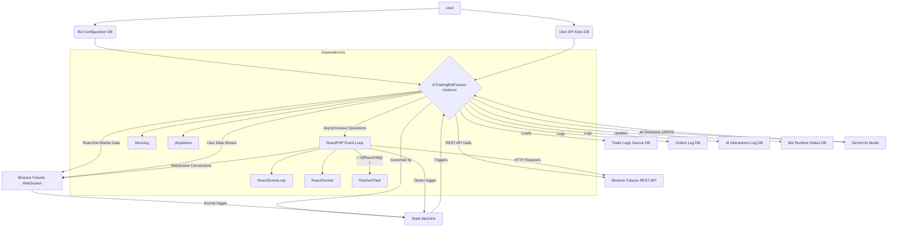

# AFRIKENKID: AI-Powered Binance Futures Trading Bot

## Introduction

AFRIKENKID is a sophisticated PHP-based trading bot meticulously engineered for automated futures trading on Binance. It leverages the advanced capabilities of the Gemini AI model for intelligent decision-making, operating on a robust, state-driven, and asynchronous architecture built with ReactPHP. This design ensures high performance, stability, and resilience against race conditions. Complementing the core bot, AFRIKENKID features a comprehensive web-based dashboard, providing users with intuitive tools for multi-bot configuration, secure API key management, real-time status monitoring, and a live strategy editor.

## Features

*   **AI-Driven Trading**: Integrates the Gemini AI model to generate dynamic and adaptive trading signals and strategies.
*   **State Machine Architecture**: The bot's core logic is governed by a formal state machine (e.g., `IDLE`, `ORDER_PENDING`, `POSITION_ACTIVE`), which prevents race conditions and ensures predictable, safe behavior in high-concurrency trading environments.
*   **Asynchronous & High-Performance**: Built on the ReactPHP event loop, enabling non-blocking I/O for concurrent network operations (HTTP requests and WebSockets) and efficient timer management, leading to superior performance.
*   **Comprehensive Web Dashboard**: Offers a user-friendly web interface with:
    *   Secure user authentication and registration.
    *   Multi-bot configuration and management.
    *   Application-level encrypted API key management.
    *   Real-time bot status monitoring (running, stopped, error, initializing, shutdown).
    *   Live strategy editor for real-time adjustments to AI directives.
    *   Detailed trade history and AI interaction logs.
*   **Dynamic AI Operating Modes**: The AI operates in four distinct modes (Executor, Tactical, Mechanical, Adaptive), determined by bot configuration, dictating its autonomy in quantity determination and strategy updates.
*   **Resilient Error Handling**: Features intelligent retry logic for temporary Binance API failures (e.g., rate limits, network issues) and immediate cessation for fatal errors, enhancing operational robustness.
*   **Automated Risk Management**: Implements automatic Stop Loss (SL) and Take Profit (TP) order placement immediately after a position is opened to manage trade risk effectively.
*   **Secure API Key Management**: Binance and Gemini API keys are stored and decrypted securely using application-level encryption with a user-defined `APP_ENCRYPTION_KEY`.
*   **Detailed Database Logging**: Comprehensive logging of all trading orders, AI interactions, and bot state transitions to a MySQL/MariaDB database for audit and analysis.
*   **Process Management**: Easy start/stop functionality for bot instances via the `bot_manager.sh` script.
*   **Comprehensive Web Dashboard**: Offers a user-friendly web interface with:
    *   Secure user authentication and registration.
    *   Multi-bot configuration and management.
    *   Application-level encrypted API key management.
    *   Real-time bot status monitoring (running, stopped, error, initializing, shutdown).
    *   Live strategy editor for real-time adjustments to AI directives.
    *   Detailed trade history and AI interaction logs.
*   **Dynamic AI Operating Modes**: The AI operates in four distinct modes (Executor, Tactical, Mechanical, Adaptive), determined by bot configuration, dictating its autonomy in quantity determination and strategy updates.
*   **Resilient Error Handling**: Features intelligent retry logic for temporary Binance API failures (e.g., rate limits, network issues) and immediate cessation for fatal errors, enhancing operational robustness.
*   **Automated Risk Management**: Implements automatic Stop Loss (SL) and Take Profit (TP) order placement immediately after a position is opened to manage trade risk effectively.
*   **Secure API Key Management**: Binance and Gemini API keys are stored and decrypted securely using application-level encryption with a user-defined `APP_ENCRYPTION_KEY`.
*   **Detailed Database Logging**: Comprehensive logging of all trading orders, AI interactions, and bot state transitions to a MySQL/MariaDB database for audit and analysis.
*   **Process Management**: Easy start/stop functionality for bot instances via the `bot_manager.sh` script.
*   **Email Notifications**: Integrated MailService for sending email notifications, such as welcome emails upon user registration.

## Architecture Overview

The bot's architecture is designed for high performance and reliability, built with PHP and leveraging asynchronous programming. The core `AiTradingBotFutures` class acts as a stateful orchestrator, managing all logic, API interactions, and AI decision-making through a well-defined lifecycle.



**Component Descriptions:**

*   **BaseController (Abstract Class)**: Provides common functionalities like authentication (`checkAuth()`) and template rendering (`render()`) for other controllers, reducing code duplication.
*   **AiTradingBotFutures (Core Class)**: The central orchestrator, a stateful PHP class that manages the bot's entire lifecycle, delegating tasks, and handling all logic, API interactions, and AI decision-making.
*   **State Machine**: The heart of the bot, a single `$botState` property dictates permissible actions at any moment, preventing race conditions and ensuring a logical, safe operational flow.
*   **ReactPHP Event Loop**: Provides the asynchronous foundation, enabling non-blocking I/O for concurrent network operations (HTTP requests and WebSockets) and efficient timer management.
*   **WebSockets (Ratchet/Pawl)**: Used for establishing persistent, real-time connections to Binance, receiving market data (Kline) and user account updates that drive state transitions.
*   **REST API Interaction**: Handles all signed and unsigned REST API calls to Binance for operations such as placing orders, fetching balances, and setting leverage, with robust retry logic.
*   **Database (MySQL/MariaDB)**: Critical for persistence and state management, storing configurations, encrypted API keys, and comprehensive logs of orders, AI interactions, and runtime statuses.
*   **AI Integration**: Manages communication with the Gemini AI model, including prompt construction, API requests, and parsing AI responses.
*   **Logging**: Utilizes Monolog for structured logging of all bot activities, including trades, AI interactions, and state changes, to both standard output and the database.
*   **Logging**: Utilizes Monolog for structured logging of all bot activities, including trades, AI interactions, and state changes, to both standard output and the database.
*   **Router (router.php)**: The central routing mechanism, now with a streamlined, array-based definition for API routes and centralized error handling, directing requests to appropriate controller methods.

## Core Bot Logic (State-Driven Lifecycle)

The bot operates as a state-driven application, with its actions strictly controlled by its current state, ensuring a logical and safe operational flow. The `transitionToState()` method is the sole entry point for state changes, logging each transition.

*   **INITIALIZING**:
    *   On startup, loads environment variables, connects to the database, and fetches its configuration.
    *   Performs strict configuration validation; invalid settings lead to bot failure.
    *   Securely loads and decrypts API keys.
    *   Fetches initial account and market data from Binance REST APIs.
    *   Establishes WebSocket connections and sets up periodic timers.
    *   Transitions to `IDLE` (no position) or `POSITION_UNPROTECTED` (existing position needs management).

*   **IDLE**:
    *   The default waiting state when the bot has no open positions and no pending entry orders.
    *   Periodically triggers `triggerAIUpdate()` to initiate an AI decision cycle.

*   **EVALUATING**:
    *   Entered when an AI update cycle begins, locking the bot from starting another evaluation until completion.
    *   Gathers a comprehensive snapshot of market, account, and bot state (`collectDataForAI`).
    *   Sends data to Gemini AI, which returns a decision (e.g., `OPEN_POSITION`, `CLOSE_POSITION`).
    *   Dispatches the AI's decision to `executeAIDecision()`.

*   **ORDER_PENDING**:
    *   The bot is waiting for its entry order to be filled.
    *   Monitors WebSocket `ORDER_TRADE_UPDATE` events for `FILLED` status.
    *   A periodic timer cancels the order if it remains unfilled for too long (e.g., 60 seconds).
    *   Upon fill, `onOrderTradeUpdate()` triggers a transition to `POSITION_UNPROTECTED`.

*   **POSITION_UNPROTECTED**:
    *   A critical, short-lived state entered immediately after an entry order is filled. The bot is in a position but lacks protective SL/TP orders.
    *   Its primary goal is to call `placeSlAndTpOrders()`.
    *   If SL/TP placement succeeds, transitions to `POSITION_ACTIVE`.
    *   If placement fails, attempts an emergency market close to mitigate risk.

*   **POSITION_ACTIVE**:
    *   The standard "in-a-trade" state. The position is open and protected by SL and TP orders.
    *   Monitors `ORDER_TRADE_UPDATE` for SL/TP hits.
    *   Periodically triggers `triggerAIUpdate()` (for potential early AI-driven exits) and `checkProfitTarget()` (if a manual profit target is set).

*   **CLOSING**:
    *   Entered whenever a position needs to be closed (due to SL/TP fill, AI decision, etc.).
    *   `handlePositionClosed()` is the entry point, immediately canceling any remaining protective orders.
    *   Once cleanup is complete, the bot transitions back to `IDLE`.

The `executeAIDecision()` function acts as a central safety supervisor. It receives the AI's suggested action and, based on the bot's current state, determines the final action to execute. It can override the AI's decision for safety (e.g., forcing a `CLOSE_POSITION` when in `STATE_POSITION_UNPROTECTED` or rejecting an `OPEN_POSITION` when a position already exists). This ensures the bot's actions are always logical and safe within its state machine.

## Setup and Installation Guide

### Prerequisites

*   PHP 8.1+
*   Composer (PHP dependency manager)
*   MySQL/MariaDB Server
*   Binance Futures API Keys (Testnet or Production)
*   Google Gemini API Key
*   SMTP Server/Service Credentials

### Step 1: Clone & Install

Clone the repository and install PHP dependencies using Composer:

```bash
git clone <repository_url>
cd appbackup # Assuming the repository name is 'appbackup' or similar
composer install
```

### Step 2: Database Setup

Import the main schema and setup data into your MySQL/MariaDB database. Replace `your_db_user` and `your_db_name` with your actual database credentials.

```bash
# Import the main schema
mysql -u your_db_user -p your_db_name < schema.sql
# Import the setup data (creates default user and configs)
mysql -u your_db_user -p your_db_name < setupdb.sql
```

**Note:** The `setupdb.sql` script creates a default user with username `testuser` and password `password` (the hash is for 'password'). You should change this default password immediately after setup for security.

### Step 3: Environment Configuration

Create a `.env` file in the root directory of the project (`/var/www/html/webapp/appbackup/.env`) based on the example below. Fill in your database credentials and generate a strong encryption key.

```dotenv
# Database Configuration
DB_HOST=127.0.0.1
DB_PORT=3306
DB_NAME=server_new
DB_USER=your_db_user
DB_PASSWORD=your_db_password

# Application Encryption Key (Generate a 32-character random string)
APP_ENCRYPTION_KEY=YOUR_VERY_STRONG_32_CHARACTER_RANDOM_KEY_HERE

# Gemini AI Configuration
GEMINI_MODEL_NAME=gemini-pro

# Mail Service Configuration (PHPMailer)
MAIL_HOST=your.smtp.host.com
MAIL_PORT=587
MAIL_USERNAME=your_smtp_username
MAIL_PASSWORD=your_smtp_password
MAIL_FROM_ADDRESS=no-reply@yourdomain.com
MAIL_FROM_NAME="AFRIKENKID Support"
```

**Security Warning:** The `APP_ENCRYPTION_KEY` is critical for encrypting your API keys. It **must** be a 32-character random string. Do not share it and keep it secure.

### Step 4: Web Server Configuration

The project includes a web-based dashboard located in the `/public` directory. You will need a web server like Apache or Nginx to serve this application.

**Document Root:**
Set your web server's document root (or base directory) to the `/public` folder of the project.

**Apache Configuration:**
If you are using Apache, ensure that `mod_rewrite` is enabled. The `.htaccess` file in the `/public` directory handles URL rewriting for the application's routing. Without `mod_rewrite` enabled and correctly configured, you will experience 404 errors for most web pages.

Example Apache Virtual Host (adjust paths as necessary):

```apache
<VirtualHost *:80>
    ServerName yourdomain.com
    DocumentRoot /var/www/html/webapp/appbackup/public

    <Directory /var/www/html/webapp/appbackup/public>
        Options Indexes FollowSymLinks
        AllowOverride All
        Require all granted
    </Directory>

    ErrorLog ${APACHE_LOG_DIR}/error.log
    CustomLog ${APACHE_LOG_DIR}/access.log combined
</VirtualHost>
```

## Usage

### First Steps (Web UI)

After completing the setup:

1.  **Log In**: Access the web dashboard by navigating to your configured web server URL (e.g., `http://localhost/`). Log in using the default credentials: `username: testuser`, `password: password`.
2.  **Add API Keys**: Navigate to the "API Keys" page (`/api-keys`) to securely add your own Binance and Gemini API keys. These keys will be encrypted at the application level before storage.
3.  **Configure Bot**: Go to the "Bots Dashboard" (`/dashboard`). You can either edit the default bot configuration or create a new one, linking it to your newly added API key set.

### Running the Bot (CLI)

The `bot_manager.sh` script is the recommended way to manage bot processes from the command line.

1.  **Make Executable**:
    ```bash
    chmod +x bot_manager.sh
    ```

2.  **Start a Bot**:
    Find the `config_id` of the bot you wish to run from the web dashboard.
    ```bash
    ./bot_manager.sh start <config_id>
    # Example: ./bot_manager.sh start 1
    ```

3.  **Stop a Bot**:
    ```bash
    ./bot_manager.sh stop <config_id>
    # Example: ./bot_manager.sh stop 1
    ```

4.  **Check Logs**:
    Logs for each bot instance are stored in the `logs/` directory. The `bot_manager.sh` script will indicate the specific log file path.
    ```bash
    tail -f logs/1.log
    ```

### Web Dashboard Features

The web interface provides comprehensive management capabilities:

*   **User Authentication**: Secure login and registration.
*   **Secure API Key Management**: Add, view, and delete encrypted Binance and Gemini API key sets.
*   **Multi-Bot Configuration**: Create, edit, and manage multiple bot instances with distinct trading symbols, intervals, leverage, and other parameters.
*   **Detailed Bot Overview**: For each bot, view real-time status, Process ID (PID), last heartbeat, performance summaries (total profit, trades executed, win rate), recent trade history, and logs of AI decisions and bot feedback.
*   **Live Strategy Editor**: A crucial feature allowing users to view and directly edit the active `strategy_directives_json` for the AI in real-time. This provides granular control over the AI's core trading logic, including its operating mode, risk parameters, and entry/exit conditions.

## AI Strategy Configuration

The AI's behavior is primarily guided by a set of directives stored as a JSON object in the `trade_logic_source` table in the database. This configuration can be edited in real-time for any user via the "Live Strategy" tab in the bot's detail view on the dashboard.

### Dynamic AI Operating Modes

The bot's AI operates in one of four distinct modes, which dictate its autonomy and how it interacts with the trading logic. These modes are determined by the `quantity_determination_method` and `allow_ai_to_update_strategy` settings in the bot's configuration (stored in the `bot_configurations` table).

*   **Executor Mode (Fixed Quantity, Fixed Strategy):**
    *   `quantity_determination_method`: `INITIAL_MARGIN_TARGET`
    *   `allow_ai_to_update_strategy`: `false`
    *   **Description:** The most constrained mode. The bot calculates the trade quantity based on the `initial_margin_target_usdt` from its configuration, and the AI is strictly forbidden from suggesting updates to its own strategy directives. The AI acts purely as an "executor" of the pre-defined strategy.

*   **Tactical Mode (AI Quantity, Fixed Strategy):**
    *   `quantity_determination_method`: `AI_SUGGESTED`
    *   `allow_ai_to_update_strategy`: `false`
    *   **Description:** In this mode, the AI has the autonomy to suggest the trade quantity. However, it is still restricted from updating its own strategy directives. The AI provides "tactical" decisions within a fixed strategic framework.

*   **Mechanical Mode (Fixed Quantity, Self-Improving Strategy):**
    *   `quantity_determination_method`: `INITIAL_MARGIN_TARGET`
    *   `allow_ai_to_update_strategy`: `true`
    *   **Description:** The trade quantity is calculated by the bot based on the `initial_margin_target_usdt`. However, the AI is allowed to suggest updates to its own `strategy_directives_json` in the database, enabling continuous learning and adaptation of the underlying strategy.

*   **Adaptive Mode (AI Quantity, Self-Improving Strategy):**
    *   `quantity_determination_method`: `AI_SUGGESTED`
    *   `allow_ai_to_update_strategy`: `true`
    *   **Description:** This is the most autonomous mode. The AI determines both the trade quantity and has the ability to suggest updates to its own strategy directives. The AI can "adapt" its behavior and strategy over time based on market conditions and performance.

### Strategy Configuration Example

The AI's behavior is heavily influenced by its strategy directives, stored as JSON in the `trade_logic_source` table. This can be edited via the "Live Strategy" Editor in the dashboard.

```json
{
  "schema_version": "2.3.0",
  "strategy_name": "Quantitative Conservative Scalper",
  "calculation_directive": "Calculate all technical indicators (e.g., EMA, RSI, ATR, Volume MA) from the raw kline data. Evaluate all strategy rules based on these calculations.",
  "objective": "Execute high-probability, short-term trades based on quantitative signals. Prioritize capital preservation and consistent, small gains. The primary goal is a profitable exit based on pre-calculated levels.",
  "risk_management_protocol": {
    "description": "Apply strict, quantitative rules for managing risk. Calculate all required values prior to trade entry.",
    "max_concurrent_positions": 1,
    "required_reward_to_risk_ratio": 1.5,
    "stop_loss_placement_rule": {
      "method": "ATR_OFFSET",
      "description": "Calculate the StopLossPrice from the entry price using the Average True Range (ATR) on the entry_timeframe to place it beyond recent noise.",
      "parameters": {
        "timeframe": "entry_timeframe",
        "atr_period": 14,
        "atr_multiplier": 2
      },
      "rule": "For BUYs: entryPrice - (ATR * atr_multiplier). For SELLs: entryPrice + (ATR * atr_multiplier)."
    },
    "profit_target_placement_rule": {
      "method": "FROM_STOP_LOSS",
      "description": "Calculate the TakeProfitPrice based on the StopLossPrice and the required_reward_to_risk_ratio to ensure a fixed risk-reward profile.",
      "rule": "For BUYs: entryPrice + ((entryPrice - stopLossPrice) * required_reward_to_risk_ratio). For SELLs: entryPrice - ((stopLossPrice - entryPrice) * required_reward_to_risk_ratio)."
    },
    "profit_protection_rule": {
      "enabled": false,
      "method": "TRAILING_STOP",
      "description": "If triggered, move the stop loss to the entry price to secure the position from loss.",
      "trigger_condition": "When trade_profit_ratio >= 1.0",
      "action": "Adjust StopLossPrice to entryPrice."
    }
  },
  "trade_entry_protocol": {
    "description": "Evaluate the following confluence of conditions to justify opening a new position. A scoring system must be used to meet the minimum confidence threshold.",
    "required_confidence_score": 3,
    "confluence_conditions": [
      {
        "id": "TREND_FILTER",
        "description": "Verify price is on the side of the medium-term trend.",
        "weight": 1,
        "timeframe": "primary_timeframe_1",
        "rule": "For BUYs: price > EMA(45). For SELLs: price < EMA(45)."
      },
      {
        "id": "MOMENTUM_STRUCTURE",
        "description": "Verify short-term momentum aligns with medium-term trend.",
        "weight": 1,
        "timeframe": "primary_timeframe_2",
        "rule": "For BUYs: EMA(9) > EMA(21). For SELLs: EMA(9) < EMA(21)."
      },
      {
        "id": "ENTRY_TRIGGER",
        "description": "Trigger an entry on a pullback to a short-term moving average.",
        "weight": 1,
        "timeframe": "entry_timeframe",
        "rule": "For BUYs: price tests and holds above EMA(9). For SELLs: price tests and holds below EMA(9)."
      },
      {
        "id": "RSI_CONFIRMATION",
        "description": "Confirm momentum with RSI and ensure market is not in overbought/oversold conditions.",
        "weight": 1,
        "timeframe": "entry_timeframe",
        "rule": "For BUYs: RSI(14) > 50 AND RSI(14) < 70. For SELLs: RSI(14) < 50 AND RSI(14) > 30."
      }
    ],
    "market_condition_filter": {
      "description": "Apply these filters to ensure the market is in a suitable state for scalping. Do not trade if any filter condition is met.",
      "volatility_filter": {
        "method": "ATR_COMPARISON",
        "timeframe": "primary_timeframe_2",
        "rule": "DO NOT TRADE if ATR(14) is > 200% of its 45-period moving average. This avoids explosive, unpredictable volatility."
      },
      "volume_filter": {
        "method": "VOLUME_MA",
        "timeframe": "primary_timeframe_2",
        "rule": "DO NOT TRADE if Volume is < 75% of its 20-period moving average. This avoids illiquid market conditions."
      }
    }
  },
  "trade_exit_protocol": {
    "description": "Evaluate the following rules to govern the active management and closure of a position.",
    "early_exit_conditions": [
      {
        "condition": "Trade Invalidation",
        "rule": "For a BUY, if a candle on the 'entry_timeframe' CLOSES below the structural support level used for entry, issue an immediate CLOSE_POSITION decision. Vice-versa for a SELL."
      },
      {
        "condition": "Momentum Failure",
        "rule": "For a BUY, if RSI(14) on 'entry_timeframe' crosses below 40, issue a CLOSE_POSITION decision. For a SELL, if RSI crosses above 60."
      },
      {
        "condition": "Time-Based Stagnation",
        "rule": "If a trade has been open for 20 candles on the 'entry_timeframe' and has not achieved the 1:1 profit_protection_rule trigger, issue a CLOSE_POSITION decision."
      }
    ]
  },
  "analysis_parameters": {
    "description": "Defines the kline data scope for analysis. Timeframes are relative to the trade type.",
    "primary_timeframe_1": "30m",
    "primary_timeframe_2": "15m",
    "entry_timeframe": "5m"
  },
  "technical_constraints": {
    "description": "Mandatory technical requirements for the bot's execution logic. Failure to comply will result in rejection.",
    "precision_adherence": "All 'price' and 'quantity' values in the response MUST strictly adhere to the precision defined in `market_data.symbol_precision`.",
    "profitability_check": "The calculated distance between `entryPrice` and `takeProfitPrice` must be greater than the round-trip commission cost. Use `market_data.commission_rates` to calculate this cost.",
    "logical_price_ordering": {
      "for_buy_orders": "entryPrice < takeProfitPrice AND entryPrice > stopLossPrice.",
      "for_sell_orders": "entryPrice > takeProfitPrice AND entryPrice < stopLossPrice."
    }
  },
  "learning_directive": {
    "description": "Mechanism for iterative strategy improvement.",
    "notes_format": "Append a JSON object to 'ai_learnings_notes' after each trade with the following keys: {trade_id, outcome (win/loss/breakeven), exit_reason (stop_loss/take_profit/early_exit_condition), confidence_score_at_entry, market_notes (e.g., 'High volatility during London open')}"
  }
}
```

## Project File Structure

```
.
├── .env
├── .gitignore
├── bot_manager.sh
├── bot.php
├── composer.json
├── default_custom_library.json
├── README.md
├── schema.sql
├── setupdb.sql
├── logs/
├── pids/
├── public/
│   ├── .htaccess
│   ├── index.php
│   └── assets/
│       ├── css/
│       │   └── style.css
│       ├── images/
│       │   └── favicon.ico
│       └── js/
│           └── app.js
├── src/
│   ├── router.php
│   ├── Controllers/
│   │   ├── ApiKeyController.php
│   │   ├── AuthController.php
│   │   ├── BaseController.php  # New: Provides common controller functionalities
│   │   └── BotController.php
│   └── Services/
│       └── Database.php
└── templates/
    ├── api_keys.php
    ├── bot_detail.php
    ├── create_config.php
    ├── dashboard.php
    ├── layout.php
    ├── login.php
    └── register.php
```

## Troubleshooting

*   **API Key Decryption Failed**: Your `APP_ENCRYPTION_KEY` in `.env` does not match the key used when you saved your API keys in the dashboard. Ensure it's a 32-character random string and consistent.
*   **Bot Fails to Start**: Check the bot's log file (`logs/<config_id>.log`) for fatal errors. This is often caused by an invalid configuration in the database or an inability to connect to Binance or the database.
*   **Bot Ignores AI Decision**: This is likely a safety feature. Check the logs for messages about being in an "unexpected state" or "failed validation." The state machine will prevent actions that are not logical for the bot's current situation.
*   **404 Errors on Web Pages**: If you can access the dashboard's homepage but get a 404 error when navigating to other pages (like `/bots/1`), it's likely that your web server's URL rewriting (`mod_rewrite` for Apache) is not configured correctly or the `.htaccess` file is not being read.
*   **Email Delivery Issues**: If email notifications are not being sent, verify your SMTP configuration in the `.env` file (MAIL_HOST, MAIL_PORT, MAIL_USERNAME, MAIL_PASSWORD, MAIL_FROM_ADDRESS, MAIL_FROM_NAME) and ensure your SMTP server is accessible and credentials are correct.
