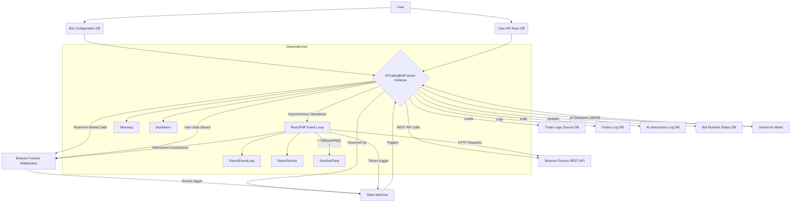

AI-Powered Futures Trading Bot

This project is a sophisticated PHP-based trading bot designed for automated futures trading on Binance. It leverages a Gemini AI model for intelligent decision-making and is built upon a robust, state-driven, asynchronous architecture to ensure high performance, stability, and resilience against race conditions.

Features

Automated Trading: Executes trades on Binance Futures based on AI-driven signals.

AI Integration: Leverages the Gemini AI model for dynamic and adaptive trading strategies.

Robust State Machine Architecture: The bot's core logic is governed by a formal state machine (IDLE, ORDER_PENDING, POSITION_ACTIVE, etc.), which prevents race conditions and ensures predictable, safe behavior in a high-concurrency environment.

Real-time Data: Receives real-time market data (Kline) and user account updates via Binance WebSockets, which drive state transitions.

Secure API Key Management: Stores and decrypts Binance and Gemini API keys securely using application-level encryption.

Hardened Validation: Implements strict, multi-layered validation for both bot configurations at startup and AI-provided trade parameters before execution, acting as a critical safety supervisor.

Automated Risk Management: Implements automatic Stop Loss (SL) and Take Profit (TP) order placement to manage trade risk immediately after a position is opened.

Comprehensive Logging: Detailed logging of all trading orders, AI interactions, and bot state transitions to a MySQL/MariaDB database and standard output.

Environment Flexibility: Supports both Binance production and testnet environments.

Dynamic Strategy Updates: The AI can suggest and update its own trading strategy directives in the database, allowing for continuous learning and adaptation (if configured).

Architecture Overview

The bot's architecture is designed for high performance and reliability, built with PHP and leveraging asynchronous programming. The core AiTradingBotFutures class acts as a stateful orchestrator, managing all logic, API interactions, and AI decision-making through a well-defined lifecycle.




Core Component: The AiTradingBotFutures PHP class is the central orchestrator. It has been refactored to be a stateful controller, delegating tasks and managing the bot's lifecycle.

State Machine: This is the heart of the refactored bot. A single $botState property dictates what the bot is allowed to do at any moment. This eliminates race conditions by ensuring, for example, that a new position cannot be opened while another one is already pending or active. All major events (WebSocket messages, timer fires, AI responses) are processed based on the current state.

Asynchronous Operations: ReactPHP provides the core event loop, enabling non-blocking I/O for concurrent network operations (HTTP requests and WebSockets) and efficient timer management.

WebSocket Communication: Ratchet/Pawl is used to establish persistent WebSocket connections to Binance. These connections provide the real-time events that drive the state machine.

REST API Interaction: The bot's internal "API component" handles all signed and unsigned REST API calls to Binance for operations like placing orders, fetching balances, and setting leverage.

#### API Component

`makeRequestWithRetry()`: This is the new, central workhorse for all critical Binance API calls (e.g., placing, canceling, or querying orders). It encapsulates the intelligent error classification (Benign, Temporary, Fatal) and the retry logic for temporary failures, ensuring robust and resilient API interactions. Higher-level functions now rely on the promise rejection from this method to trigger their safety procedures.

Database (MySQL/MariaDB): The database is critical for persistence and state management, storing configurations, encrypted API keys, and comprehensive logs of all orders, AI interactions, and runtime statuses.

AI Integration: The bot's internal "AI service component" manages communication with the Gemini AI, including prompt construction, API requests, and response parsing.

Logging & Environment: Monolog and phpdotenv are used for structured logging and secure environment configuration, respectively.

Logical Functioning of the Bot (State-Driven Lifecycle)

The refactored bot operates as a state-driven application. Its actions are strictly controlled by its current state, ensuring a logical and safe operational flow.

Initialization (STATE_INITIALIZING):

On startup, the bot loads environment variables, connects to the database, and fetches its configuration.

Configuration Validation: A strict validation check is performed on the loaded configuration. If any setting is invalid (e.g., leverage out of range), the bot will fail to start.

It securely loads and decrypts the required API keys.

It fetches initial account and market data from Binance REST APIs.

It establishes WebSocket connections and sets up periodic timers.

Based on whether an existing position is found, it transitions to its initial operational state: STATE_IDLE (no position) or STATE_POSITION_UNPROTECTED (existing position needs management).

The IDLE State:

This is the default waiting state. The bot has no open positions and no pending entry orders.

It waits for a periodic timer to fire triggerAIUpdate().

The EVALUATING State:

Entered when an AI update cycle begins. The bot is locked from starting another evaluation until this one completes.

Data Collection (collectDataForAI): A comprehensive snapshot of the market, account, and bot's current state is gathered.

AI Interaction: The data is sent to the Gemini AI, which returns a decision (OPEN_POSITION, CLOSE_POSITION, etc.).

Decision Dispatching (executeAIDecision): The AI's decision is dispatched to a central handler, `executeAIDecision()`, which acts as a safety supervisor. This method intelligently routes the AI's suggested action based on the bot's current state and can override the AI's decision for safety (e.g., forcing a `CLOSE_POSITION` when in `STATE_POSITION_UNPROTECTED` or rejecting an `OPEN_POSITION` when a position already exists).

Executing an OPEN_POSITION Decision:

When an `OPEN_POSITION` decision is received (and not overridden by `executeAIDecision`):

AI Parameter Validation: The bot performs its own strict validation on the AI's suggested parameters (price, quantity, SL/TP) using `validateOpenPositionParams()`. This function is critical for safety. It handles quantity determination in two ways:
    *   **AI-Suggested Quantity:** If the bot's configuration `quantity_determination_method` is `AI_SUGGESTED`, the bot uses the quantity provided directly by the AI.
    *   **Calculated Quantity:** If the method is `INITIAL_MARGIN_TARGET`, the bot calculates the quantity based on the `initialMarginTargetUsdt` from its configuration and the AI's suggested entry price and leverage.
It also checks for valid numbers and logical consistency (e.g., for a LONG, SL must be < Entry Price). If invalid, the action is rejected, and the bot returns to `STATE_IDLE`.

If valid, `attemptOpenPosition()` is called, which places a limit order on Binance.

The bot immediately transitions to `STATE_ORDER_PENDING`.

The ORDER_PENDING State:

The bot is now waiting for its entry order to be filled. It monitors two things:

A WebSocket `ORDER_TRADE_UPDATE` event with a `FILLED` status.

A periodic timer that will cancel the order if it remains unfilled for too long (e.g., 60 seconds).

If the order is filled, the `onOrderTradeUpdate()` handler is triggered.

The POSITION_UNPROTECTED State:

This is a critical, short-lived state entered immediately after an entry order is filled. The bot is in a position but does not yet have its SL and TP orders in place.

Its only goal in this state is to place the protective orders by calling `placeSlAndTpOrders()`.

If placing the SL/TP orders succeeds, the bot transitions to `STATE_POSITION_ACTIVE`.

If placing them fails, it will attempt an emergency market close of the position to eliminate risk.

The POSITION_ACTIVE State:

This is the standard "in-a-trade" state. The position is open and protected by SL and TP orders.

The bot now monitors for several events:

An `ORDER_TRADE_UPDATE` message indicating the SL or TP has been hit.

A timer firing `triggerAIUpdate()`, which could lead to an AI decision to close the position early.

A timer firing `checkProfitTarget()` if a manual profit target is set.

The CLOSING State:

This state is entered whenever a position needs to be closed (due to SL/TP fill, AI decision, etc.).

The `handlePositionClosed()` function is the entry point. It immediately cancels any remaining protective orders (e.g., if TP is hit, the SL order is cancelled).

Once all cleanup is complete, the bot transitions back to `STATE_IDLE`, ready for the next trade.

### Error Handling and Resilient Recovery Flow

The bot now features a centralized and intelligent error recovery system, significantly enhancing its resilience to transient issues like temporary API or network failures. All critical Binance API interactions, such as placing and canceling orders, are routed through a single, robust wrapper method: `makeRequestWithRetry()`. This method intelligently classifies API errors into three categories, dictating the bot's response:

*   **Benign Failures:** These are errors that, paradoxically, indicate a successful outcome from the bot's perspective (e.g., attempting to cancel an order that has already been filled or canceled by the exchange). The bot logs these events as warnings and continues its normal operation without interruption, as the desired state has been achieved.

*   **Temporary Failures:** This category includes transient issues such as network timeouts, Binance API rate limits, or temporary exchange server errors. For these recoverable errors, the bot automatically retries the failed API action up to 3 times with an exponential backoff delay. This finite retry loop is crucial for maintaining operational continuity, preventing minor, temporary glitches from escalating into unnecessary high-level state changes or bot halts.

*   **Fatal Failures:** These represent unrecoverable errors that indicate a fundamental problem, such as invalid API keys, incorrect account permissions, or malformed request parameters. Upon encountering a fatal error, the bot immediately ceases operation, logs the critical failure, and escalates to a high-alert safety state. This ensures that the bot does not continue operating under compromised or invalid conditions.

This centralized approach to error handling improves the overall stability, predictability, and robustness of the trading system, allowing it to gracefully navigate common network and API instabilities without requiring manual intervention for minor issues.

### Dynamic AI Operating Modes

The bot's AI operates in one of four distinct modes, which dictate its autonomy and how it interacts with the trading logic. These modes are determined by the `quantity_determination_method` and `allow_ai_to_update_strategy` settings in the bot's configuration (stored in the `bot_configurations` table).

*   **Executor Mode (Fixed Quantity, Fixed Strategy):**
    *   `quantity_determination_method`: `INITIAL_MARGIN_TARGET`
    *   `allow_ai_to_update_strategy`: `false`
    *   **Description:** This is the most constrained mode. The bot calculates the trade quantity based on the `initialMarginTargetUsdt` from its configuration, and the AI is strictly forbidden from suggesting updates to its own strategy directives. The AI acts purely as an "executor" of the pre-defined strategy.

*   **Tactical Mode (AI Quantity, Fixed Strategy):**
    *   `quantity_determination_method`: `AI_SUGGESTED`
    *   `allow_ai_to_update_strategy`: `false`
    *   **Description:** In this mode, the AI has the autonomy to suggest the trade quantity. However, it is still restricted from updating its own strategy directives. The AI provides "tactical" decisions within a fixed strategic framework.

*   **Mechanical Mode (Fixed Quantity, Self-Improving Strategy):**
    *   `quantity_determination_method`: `INITIAL_MARGIN_TARGET`
    *   `allow_ai_to_update_strategy`: `true`
    *   **Description:** The trade quantity is calculated by the bot based on the `initialMarginTargetUsdt`. However, the AI is allowed to suggest updates to its own `strategy_directives_json` in the database, enabling continuous learning and adaptation of the underlying strategy.

*   **Adaptive Mode (AI Quantity, Self-Improving Strategy):**
    *   `quantity_determination_method`: `AI_SUGGESTED`
    *   `allow_ai_to_update_strategy`: `true`
    *   **Description:** This is the most autonomous mode. The AI determines both the trade quantity and has the ability to suggest updates to its own strategy directives. The AI can "adapt" its behavior and strategy over time based on market conditions and performance.

Functions Present and Their Internal Working (Refactored)

The AiTradingBotFutures class is now organized into logical components, with key methods driving the state machine.

Core Lifecycle & State Management

`__construct(...)`: Initializes the bot, dependencies, logger, and loads all configurations.

`run()`: The main entry point that starts the event loop and the entire bot lifecycle.

`stop()`: Gracefully stops the bot, cancels timers, and closes connections.

`transitionToState(string $newState, array $context = [])`: The central state management function. All changes to the bot's operational state must pass through this method, which logs the transition and ensures predictable behavior.

`$botState`: A private string property that holds the current state of the bot (e.g., `STATE_IDLE`, `STATE_POSITION_ACTIVE`). This replaces the old collection of boolean flags.

WebSocket & Timer Event Handlers

`handleUserDataStreamEvent(array $eventData)`: A dispatcher that routes incoming user data events to more specific handlers.

`onOrderTradeUpdate(array $orderData)`: The primary driver of state transitions during a trade. It handles order fills, cancellations, and rejections, moving the bot from `ORDER_PENDING` to `POSITION_UNPROTECTED`, and triggering the final cleanup when a position is closed.

`onAccountUpdate(array $accountData)`: Monitors for external account changes, such as a position being closed manually on the Binance website, and triggers a state reconciliation.

`onListenKeyExpired()`: Manages the renewal of the WebSocket listen key.

`setupTimers()`: Configures all periodic timers for heartbeats, AI updates, and order timeout checks.

AI Decision & Execution Logic

`triggerAIUpdate(bool $isEmergency = false)`: Initiates the AI decision cycle, transitioning the bot to the `EVALUATING` state.

`executeAIDecision(array $decision)`: This is the central decision dispatcher and safety supervisor. It receives the AI's suggested action and, based on the bot's current state, determines the final action to execute. It can override the AI's decision for safety, for example:
    *   If the bot is in `STATE_POSITION_UNPROTECTED`, it will force a `CLOSE_POSITION` to mitigate risk, regardless of the AI's suggestion.
    *   If the AI suggests `OPEN_POSITION` while a position already exists, the bot will override it to `HOLD_POSITION` to prevent multiple concurrent positions (unless configured otherwise).
    *   If the AI suggests an action like `CLOSE_POSITION` while the bot is `IDLE`, it will be overridden to `DO_NOTHING`.
This method ensures that the bot's actions are always logical and safe within its state machine.

`validateOpenPositionParams(array $params)`: A crucial security function that performs strict validation on all parameters provided by the AI before a trade is placed. It checks for logical consistency (e.g., SL/TP placement relative to entry price) in addition to valid data types. It also determines the trade quantity based on the bot's configuration (`quantity_determination_method`), either using the AI's suggested value or calculating it from `initialMarginTargetUsdt`.

Position & Order Management

`attemptOpenPosition()`: Called from a state handler to place the initial limit entry order. This function now relies on the centralized `makeRequestWithRetry()` for API interaction, and its promise rejection will trigger high-level safety procedures like transitioning to `STATE_POSITION_UNPROTECTED` if the order placement fails.

`placeSlAndTpOrders()`: Called immediately after an entry order is filled. Its sole purpose is to place protective SL and TP orders and move the bot to the safe `STATE_POSITION_ACTIVE`. Similar to `attemptOpenPosition()`, it leverages `makeRequestWithRetry()` and handles promise rejections to manage failures, potentially leading to an emergency market close of the position.

`attemptClosePositionByAI(bool $isEmergency = false)`: Initiates a market close of the current position.

`handlePositionClosed()`: A central cleanup function triggered when any closing event occurs. It immediately cancels any remaining protective orders (e.g., if TP is hit, the SL order is cancelled) by routing through `makeRequestWithRetry()`. Failures in cancellation will trigger appropriate high-level safety procedures, such as transitioning to `STATE_POSITION_UNPROTECTED` to ensure the bot's state accurately reflects the market. Once all cleanup is complete, the bot transitions back to the `STATE_IDLE`.

Recreation Guide

To set up and run a similar bot, follow these steps:

Prerequisites

PHP 8.1+

Composer (PHP dependency manager)

MySQL/MariaDB Server

Binance Futures API Keys (Testnet or Production)

Google Gemini API Key

Setup Steps

Clone the Repository & Install Dependencies:

```bash
git clone <repository_url>
cd <repository_name>
composer install
```

Environment Configuration (.env file):
Create a .env file in the root directory.

```dotenv
# Database Configuration
DB_HOST=127.0.0.1
DB_PORT=3306
DB_NAME=server_new
DB_USER=your_db_user
DB_PASSWORD=your_db_password

# Application Encryption Key (Generate a 32-character random string)
APP_ENCRYPTION_KEY=YOUR_VERY_STRONG_32_CHARACTER_RANDOM_KEY_HERE

# Gemini AI Configuration
GEMINI_MODEL_NAME=gemini-pro
```

Security: The APP_ENCRYPTION_KEY is critical. Generate a strong, random key and keep it secret.

Database Setup:
Import the provided SQL schemas into your database.

```bash
mysql -u your_db_user -p your_db_name < schema.sql
mysql -u your_db_user -p your_db_name < setupdb.sql
```

The `setupdb.sql` file creates a default user and bot configuration. You will need to use the `dashboard.php` interface to add your own securely encrypted API keys and manage bot configurations.

### Dashboard Features

The `dashboard.php` file provides a powerful web interface for managing your trading bots:

*   **User Authentication:** Secure login and registration system to manage your bot configurations and API keys.
*   **Secure API Key Management:** Add, view, and delete your Binance and Gemini API key sets. All keys are encrypted at the application level using your `APP_ENCRYPTION_KEY` before being stored in the database.
*   **Multi-Bot Configuration:** Create, edit, and manage multiple bot instances, each with its own trading symbol, kline interval, leverage, and other parameters.
*   **Detailed Bot Overview:** For each configured bot, you can view:
    *   Real-time status (running, stopped, error, initializing, shutdown).
    *   Process ID (PID) and last heartbeat.
    *   Performance summary (total profit, trades executed, win rate, last trade time).
    *   Recent trade history.
    *   Logs of AI decisions and bot feedback.
*   **Live Strategy Editor:** A crucial feature that allows users to view and directly edit the active `strategy_directives_json` for the AI. This provides real-time control over the AI's core trading logic, including its operating mode, risk parameters, and entry/exit conditions.

### Strategy Configuration Example

The AI's behavior is heavily influenced by its strategy directives, stored as JSON in the `trade_logic_source` table. Below is an example of a `strategy_directives_json` (from `d.json`) that users can edit via the Live Strategy Editor in the dashboard. Note that `quantity_determination_method` and `allow_ai_to_update_strategy` are bot-level configuration parameters and are not part of this JSON.

```json
{
  "schema_version": "1.0.0",
  "strategy_type": "GENERAL_TRADING",
  "current_market_bias": "NEUTRAL",
  "User prompt": [
    "Take profit Sniper entries."
  ],
  "preferred_timeframes_for_entry": [
    "1m",
    "5m",
    "15m"
  ],
  "key_sr_levels_to_watch": {
    "support": [],
    "resistance": []
  },
  "risk_parameters": {
    "target_risk_per_trade_usdt": 10.5,
    "default_rr_ratio": 3,
    "max_concurrent_positions": 1
  },
  "entry_conditions_keywords": [
    "momentum_confirm",
    "breakout_consolidation"
  ],
  "exit_conditions_keywords": [
    "momentum_stall",
    "target_profit_achieved"
  ],
  "leverage_preference": {
    "min": 100,
    "max": 100,
    "preferred": 100
  },
  "ai_confidence_threshold_for_trade": 0.7,
  "ai_learnings_notes": "Initial default strategy directives. AI to adapt based on market and trade outcomes.",
  "emergency_hold_justification": "Wait for clear market signal or manual intervention."
}
```

Running the Bot

The `bot_manager.sh` script is the recommended way to manage bot processes.

Make the script executable (one time):

```bash
chmod +x bot_manager.sh
```

Start a bot:
Find the config_id from the dashboard.

```bash
./bot_manager.sh start <config_id>
# Example: ./bot_manager.sh start 1
```

Stop a bot:

```bash
./bot_manager.sh stop <config_id>
# Example: ./bot_manager.sh stop 1
```

Check logs:
The script will tell you the log file path.

```bash
tail -f logs/1.log
```
Troubleshooting

API Key Decryption Failed: Your APP_ENCRYPTION_KEY in .env does not match the key used when you saved your API keys in the dashboard.

Bot Fails to Start: Check the bot's log file (logs/<config_id>.log) for fatal errors. Often caused by an invalid configuration in the database or an inability to connect to Binance or the database.

Bot Ignores AI Decision: This is likely a safety feature. Check the logs for messages about being in an "unexpected state" or "failed validation." The state machine will prevent actions that are not logical for the bot's current situation.
